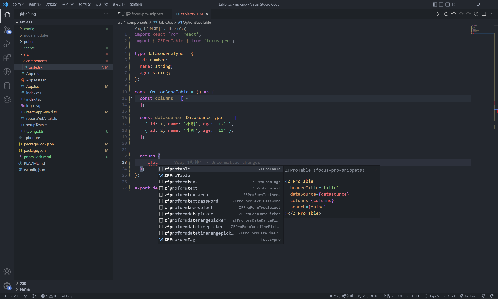

## 介绍

为了更优秀的开发体验，Focus Pro 构建了一个`VSCode 插件`。

## 特性

- 🛠️ 支持全组件的语法提示、快速补全。
- 🛠️ 支持全组件的文档地址预览、快速跳转。

## 安装

VSCode 插件市场搜索`focus-pro-snippets`

## 如何使用

输入组件名称关键字时出现语法提示，选中后进行快速补全。

鼠标移动到组件名会显示组件的文档地址用来点击跳转。

